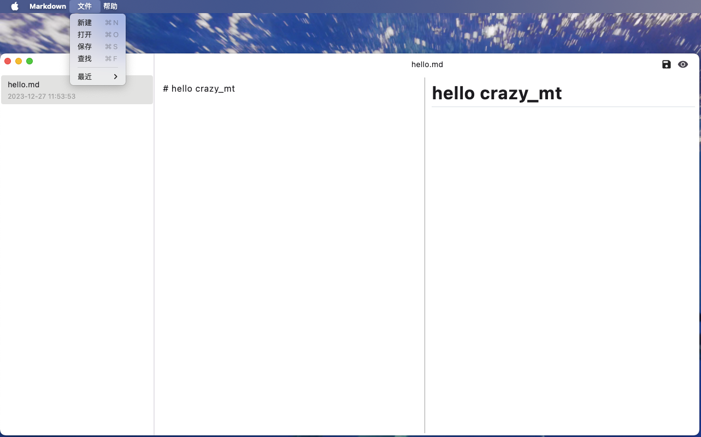

# MT_Markdown

A new Flutter project.

## Getting Started

这个 Flutter Markdown 编辑器是一个功能全面的桌面应用，支持新建、保存、编辑 Markdown 文件，拖拽本地文件，记录文件历史，并通过快捷键提升用户体验，依赖于 desktop_drop、cross_file、markdown_widget、file_picker、bitsdojo_window、contextmenu 等库来实现丰富的功能和流畅的用户界面。

